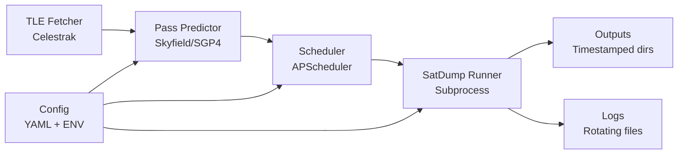

# WARP.md

This file provides guidance to WARP (warp.dev) when working with code in this repository.

## Table of Contents

- [What is meteor-auto](#what-is-meteor-auto)
- [Quickstart (TL;DR)](#quickstart-tldr)
- [Prerequisites](#prerequisites)
- [Installation and Environment Setup](#installation-and-environment-setup)
  - [Local Installation](#local-installation)
  - [Raspberry Pi 3 (Project Environment)](#raspberry-pi-3-project-environment)
- [Configuration](#configuration)
- [Commonly Used Commands](#commonly-used-commands)
  - [Development Commands](#development-commands)
  - [Operations Commands](#operations-commands)
- [High-Level Architecture](#high-level-architecture)
- [Scheduling and Services](#scheduling-and-services)
  - [Systemd Service](#systemd-service)
  - [Optional: Streamlit UI](#optional-streamlit-ui)
- [Logs and Observability](#logs-and-observability)
- [Data Layout and Outputs](#data-layout-and-outputs)
- [Troubleshooting](#troubleshooting)
- [FAQ](#faq)

## What is meteor-auto

meteor-auto is a headless automation tool that predicts METEOR-M satellite passes (N2-3/N2-4) using TLE data and Skyfield, schedules SatDump live LRPT captures at the optimal times, and manages the entire capture workflow. It's designed for unattended operation on Linux systems including Raspberry Pi, with robust error handling, fallback frequencies, and systemd integration.

## Quickstart (TL;DR)

**Prerequisites**: SatDump installed and RTL-SDR working

```bash
# Install
python -m venv .venv
source .venv/bin/activate
pip install -e .

# Configure (edit your coordinates and SatDump path)
cp configs/config.example.yaml configs/config.yaml
nano configs/config.yaml

# Test prediction (should show upcoming passes)
meteor-auto --config configs/config.yaml list-passes --hours 48

# Dry-run scheduling (no actual SatDump execution)
meteor-auto --config configs/config.yaml run --dry-run

# Start headless scheduler
meteor-auto --config configs/config.yaml run
```

## Prerequisites

- **OS**: Linux (Debian/Ubuntu/Raspberry Pi OS recommended)
- **Python**: ≥3.10 (as specified in pyproject.toml)
- **Hardware**: RTL-SDR v4 or compatible SDR device
- **External tools**:
  - [SatDump](https://github.com/SatDump/SatDump) installed and available in PATH
  - rtl-sdr packages and udev rules for RTL-SDR
  - Time synchronization (chrony or systemd-timesyncd)

**Verify prerequisites**:
```bash
satdump --version
rtl_test -t  # Should detect RTL-SDR device
```

**RTL-SDR setup** (if needed):
```bash
sudo apt update
sudo apt install -y rtl-sdr chrony
# Add user to plugdev group
sudo usermod -a -G plugdev $USER
# Log out and back in for group changes
```

## Installation and Environment Setup

### Local Installation

```bash
# Clone repository
git clone <repository-url>
cd meteor-auto

# Create virtual environment
python -m venv .venv
source .venv/bin/activate

# Install dependencies
pip install -U pip
pip install -e .

# Verify installation
meteor-auto --version
pytest -v  # Run tests
```

### Raspberry Pi 3 (Project Environment)

**Important**: For this project's Raspberry Pi 3 environment, always use the existing meshtastic virtual environment:

```bash
# Connect to Pi
ssh strikerdlm@192.168.1.188
cd meshtastic
source meshtastic/bin/activate

# Install system dependencies (one-time)
sudo apt update
sudo apt install -y rtl-sdr chrony build-essential
# Install SatDump following official documentation

# Install meteor-auto
git clone <repository-url>
cd meteor-auto
pip install -e .

# Configure
cp configs/config.example.yaml config.yaml
nano config.yaml  # Set coordinates and SatDump path

# Test installation
meteor-auto --help
meteor-auto --config config.yaml list-passes --hours 24
```

**Note**: All operational commands in this document should be run after activating the meshtastic virtual environment on the Pi.

## Configuration

Configuration uses YAML format with environment variable overrides. Precedence: CLI flags > environment variables > config file.

**Default config locations**: `configs/config.yaml` or path specified with `--config`

**Complete example configuration**:
```yaml
# QTH (station location) - REQUIRED
qth:
  lat: 4.7110      # Latitude in decimal degrees
  lon: -74.0721    # Longitude in decimal degrees  
  alt: 2640        # Altitude in meters

# Prediction parameters
lookahead: 24      # Hours to look ahead for passes
min_elev: 20.0     # Minimum elevation in degrees

# Frequencies (Hz)
frequencies:
  primary: 137900000    # Primary LRPT frequency
  backup: 137100000     # Backup frequency for fallback

# SatDump pipelines
pipelines:
  primary: meteor_m2-x_lrpt      # Primary pipeline
  fallback: meteor_m2-x_lrpt_80k # Fallback pipeline

# SatDump configuration
satdump:
  path: satdump              # SatDump executable path
  gain: 40                   # RF gain in dB
  bias: false               # Enable bias-tee for LNA
  samplerate: 1024000       # Sample rate in Hz
  agc: false                # Enable AGC
  # http_bind: 0.0.0.0:8080 # Optional HTTP server

# Directory paths
paths:
  outputs: outputs  # Output directory for captures
  logs: logs       # Log directory  
  cache: .cache    # Cache directory for TLEs
```

**Environment variable overrides** (prefix: `METEOR_AUTO_`):
- `METEOR_AUTO_LAT`, `METEOR_AUTO_LON`, `METEOR_AUTO_ALT_M`
- `METEOR_AUTO_LOOKAHEAD_H`, `METEOR_AUTO_MIN_ELEV_DEG`
- `METEOR_AUTO_FREQ_PRIMARY_HZ`, `METEOR_AUTO_FREQ_BACKUP_HZ`
- `METEOR_AUTO_GAIN_DB`, `METEOR_AUTO_BIAS_TEE`
- `METEOR_AUTO_SATDUMP_PATH`
- `METEOR_AUTO_OUTPUTS_DIR`, `METEOR_AUTO_LOGS_DIR`, `METEOR_AUTO_CACHE_DIR`

## Commonly Used Commands

### Development Commands

```bash
# Activate environment
source .venv/bin/activate

# Run tests
pytest -v
pytest tests/test_config.py -v  # Specific test file

# Type checking (if mypy is available)
mypy meteor_auto/

# Code formatting (if available)
black meteor_auto/
ruff check meteor_auto/

# Install development dependencies
pip install -r requirements-dev.txt

# Build package
python -m build
```

### Operations Commands

**List upcoming passes**:
```bash
meteor-auto --config configs/config.yaml list-passes --hours 48
meteor-auto --lookahead 72 --min-elev 15 list-passes
```

**Run scheduler**:
```bash
# Dry-run (plan without executing SatDump)
meteor-auto --config configs/config.yaml run --dry-run

# Actually run scheduler (blocks until interrupted)
meteor-auto --config configs/config.yaml run

# With overrides
meteor-auto --config configs/config.yaml --lookahead 24 --min-elev 20 run
```

**Using environment variables**:
```bash
# Load .env file
meteor-auto --env .env --config configs/config.yaml list-passes
```

**Streamlit UI**:
```bash
# Start web interface (optional)
streamlit run scripts/streamlit_app.py
# Access at http://localhost:8501
```

## High-Level Architecture



**Components**:

- **TLE Fetcher** (`tle.py`): Downloads and caches TLE data from Celestrak weather satellites
- **Pass Predictor** (`predict.py`): Uses Skyfield to compute AOS/TCA/LOS times and elevation angles
- **Scheduler** (`scheduler.py`): Uses APScheduler to schedule SatDump captures with proper timing margins
- **Runner** (`runner.py`): Manages SatDump process lifecycle and fallback logic
- **Config** (`config.py`): Handles YAML config files and environment variable overrides

**Concurrency & Error Handling**:
- Single SDR lock prevents overlapping captures
- Fallback frequency/pipeline after failures
- Automatic retry with different parameters
- Graceful shutdown on SIGINT/SIGTERM

## Scheduling and Services

### Systemd Service

**Install as system service** (provided in `systemd/meteor-auto.service`):

```bash
# Copy config to system location
sudo mkdir -p /etc/meteor-auto
sudo cp configs/config.yaml /etc/meteor-auto/config.yaml

# Install service
sudo cp systemd/meteor-auto.service /etc/systemd/system/
sudo systemctl daemon-reload
sudo systemctl enable --now meteor-auto

# Check status
sudo systemctl status meteor-auto
journalctl -u meteor-auto -f
```

**Service configuration**:
- Runs as simple service type
- Restarts on failure with 5s delay
- Sets `PYTHONUNBUFFERED=1` for proper logging
- Requires network and uses absolute paths

### Optional: Streamlit UI

The repository includes a Streamlit-based web interface for configuration and monitoring:

```bash
# Install extra dependencies (already in requirements.txt)
pip install streamlit

# Run UI
streamlit run scripts/streamlit_app.py

# Access at http://localhost:8501
```

**UI Features**:
- Edit configuration interactively
- View predicted passes
- Dry-run scheduler
- View recent logs

## Logs and Observability

**Log locations**:
- Default: `logs/meteor-auto.log` (configurable via config)
- Systemd: `journalctl -u meteor-auto`

**Log levels**: DEBUG, INFO, WARNING, ERROR

**Viewing logs**:
```bash
# File logs
tail -f logs/meteor-auto.log

# Systemd logs  
journalctl -u meteor-auto -f
journalctl -u meteor-auto --since "1 hour ago"

# Debug mode
meteor-auto --config configs/config.yaml run  # Already logs INFO level
```

**Log rotation**: Handled by Python's RotatingFileHandler (5MB per file, 5 backups)

## Data Layout and Outputs

**Directory structure** (under `paths.outputs`):
```
outputs/
├── 20250918_123400_METEOR-M_2-3/    # Timestamped per pass
│   ├── products/                     # SatDump decoded images
│   ├── dataset/                      # Raw LRPT data  
│   └── *.log                         # SatDump execution logs
├── 20250918_154200_METEOR-M_2-4/
└── ...
```

**Naming convention**: `YYYYMMDD_HHMMSS_SATELLITE_NAME` (UTC times)

**File types**:
- `.png`, `.jpg`: Decoded weather images
- `.lrpt`: Raw LRPT bitstream
- `.cadu`: Frame data
- Log files from SatDump execution

**Retention**: No automatic cleanup implemented. Consider adding cron job:
```bash
# Remove captures older than 30 days
0 2 * * * find /path/to/outputs -type d -mtime +30 -exec rm -rf {} \;
```

## Troubleshooting

**SatDump not found**:
- Ensure SatDump is installed: `satdump --version`
- Check `satdump.path` in config or set `METEOR_AUTO_SATDUMP_PATH`
- Use absolute path if not in PATH

**No passes predicted**:
- Verify station coordinates in config (lat/lon/alt)
- Check TLE cache: `.cache/weather.tle` should exist and be recent
- Try lower minimum elevation: `--min-elev 10`
- Increase lookahead window: `--lookahead 72`

**RTL-SDR permission errors**:
```bash
# Add user to plugdev group
sudo usermod -a -G plugdev $USER
# Install udev rules
sudo apt install rtl-sdr
# Restart or re-login
```

**Capture failures/poor quality**:
- Check antenna orientation (V-dipole or QFH recommended)
- Verify bias-tee setting matches LNA requirements
- Adjust gain (try 35-45 dB range)
- Ensure stable sample rate (1.024 Msps recommended)
- Check for RF interference (FM broadcast, etc.)

**Scheduler issues**:
- Only one capture runs at a time (lock file protection)
- Stale locks (>4 hours) are automatically removed
- Check systemd service status if running as daemon

## FAQ

**Q: How do I target only specific METEOR satellites?**
A: Currently all METEOR satellites found in TLEs are targeted. You would need to modify `tle.py:select_meteor_targets()` to filter by name or NORAD ID.

**Q: Can I run a dry-run to see what would be scheduled?**
A: Yes, use `meteor-auto run --dry-run` to see planned captures without executing SatDump.

**Q: How do I change the output directory?**
A: Set `paths.outputs` in config or use `METEOR_AUTO_OUTPUTS_DIR` environment variable.

**Q: What if my RTL-SDR device is not /dev/rtlsdr0?**
A: SatDump automatically detects RTL-SDR devices. For multiple devices, you may need to specify device index in SatDump arguments (future enhancement).

**Q: How do I update TLE data manually?**
A: TLE data is fetched automatically when running predictions. The cache file is `.cache/weather.tle` and is updated as needed.

**Q: Can I use different sample rates?**
A: Yes, modify `satdump.samplerate` in config. 1.024 Msps is recommended for stability. Avoid 250 ksps.

**Q: How do I enable bias-tee for my LNA?**
A: Set `satdump.bias: true` in config or `METEOR_AUTO_BIAS_TEE=true` environment variable.

**Q: What frequencies are used?**
A: Primary 137.900 MHz, backup 137.100 MHz. The system automatically falls back to backup frequency after capture failures.